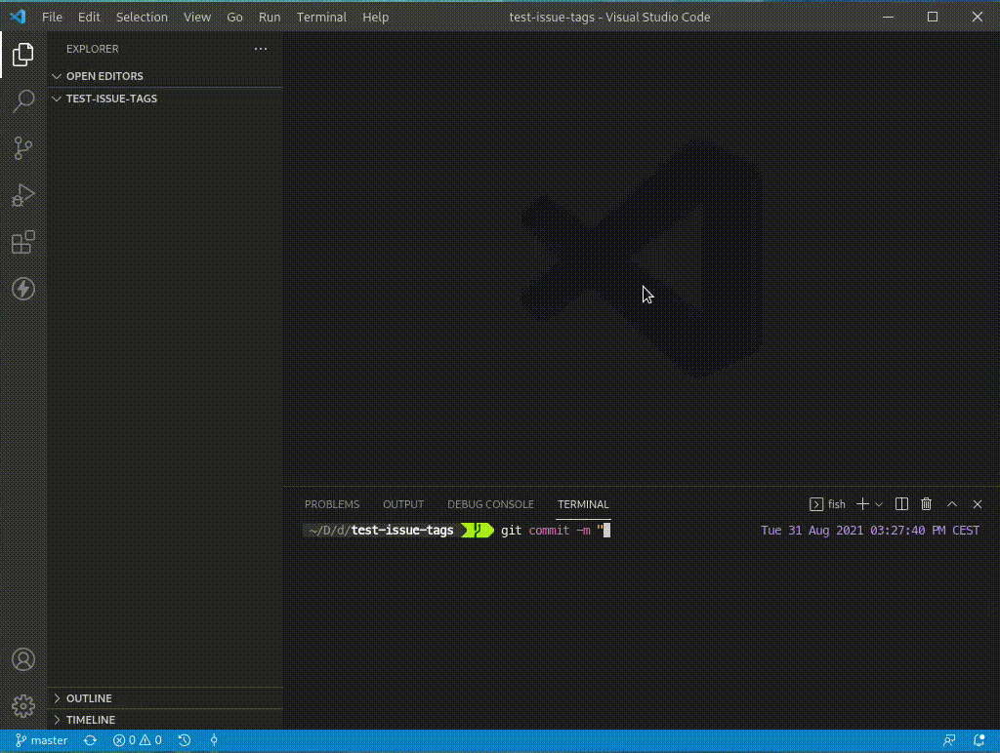

# Gitlab Issue Tags 

Access issues in your GitLab repository and use their tags in commit messages.

### Default keybinding: `ctrl-alt-g`

## Authentication

The extension uses the [Gitlab API](https://docs.gitlab.com/ee/api/), in order to gain access to it, you must provide a personal access token - [Create a personal access token](https://docs.gitlab.com/ee/user/profile/personal_access_tokens.html#create-a-personal-access-token)